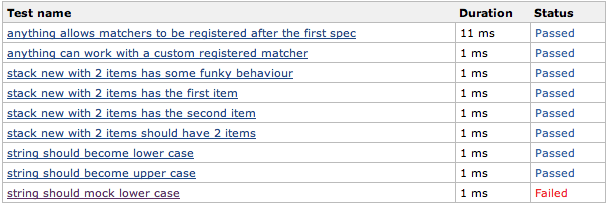

What is different in this fork?
======================

This fork of the [OCUnit2JUnit script](https://github.com/ciryon/OCUnit2JUnit) allows to read output from [Kiwi BDD Testing Framework](https://github.com/allending/Kiwi) and creates proper readable names for your CI environment. With the original version, all your specs would be called 'example', while this version uses your descriptions as method names.

More information
======================

For more information on this script and how to use it, read on in [the original project](https://github.com/ciryon/OCUnit2JUnit).

Licence
======================

Free to use however you want.
